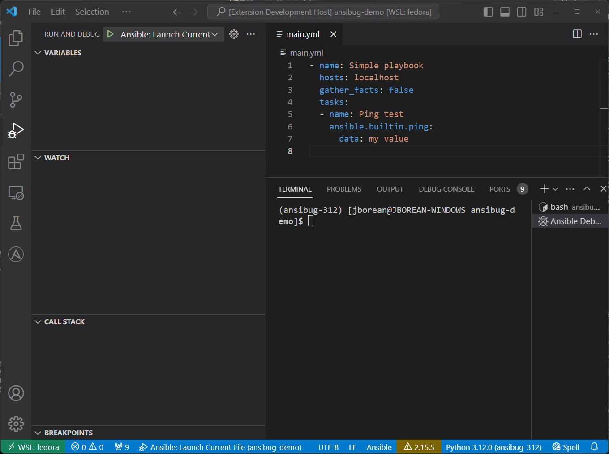
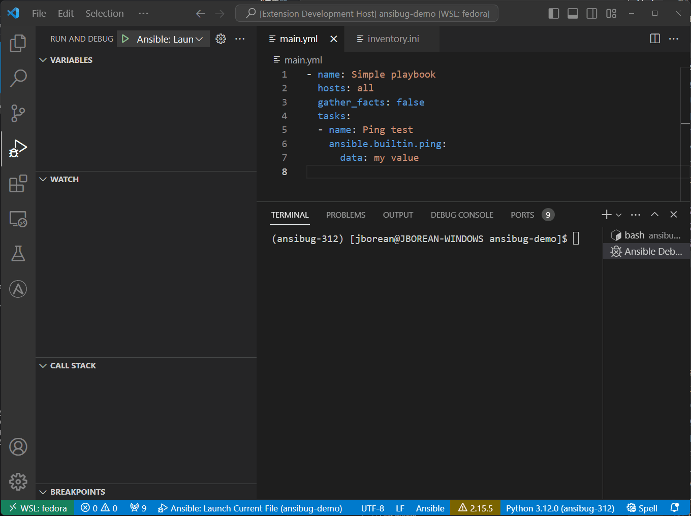
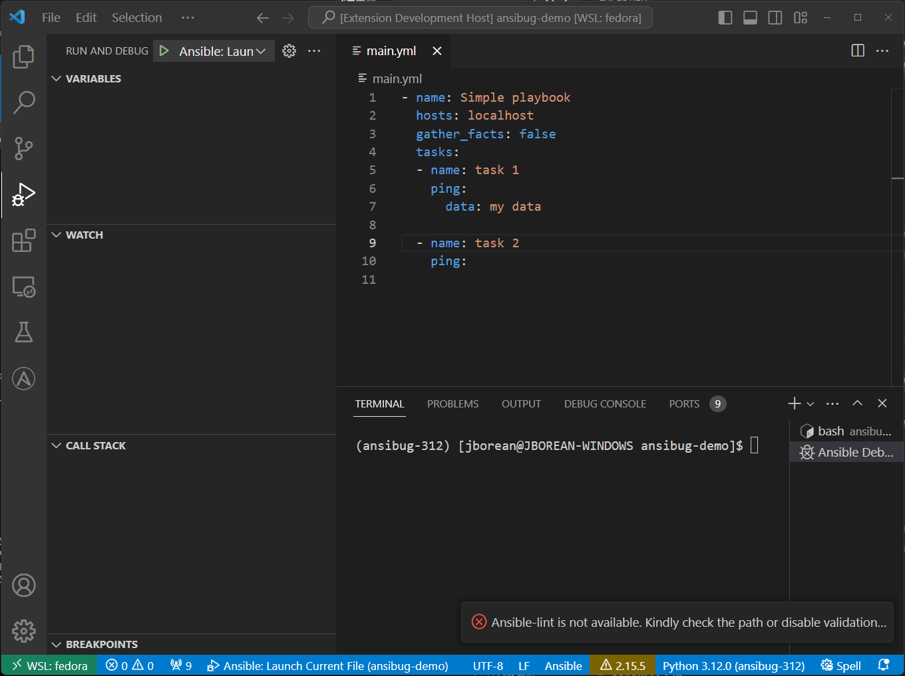
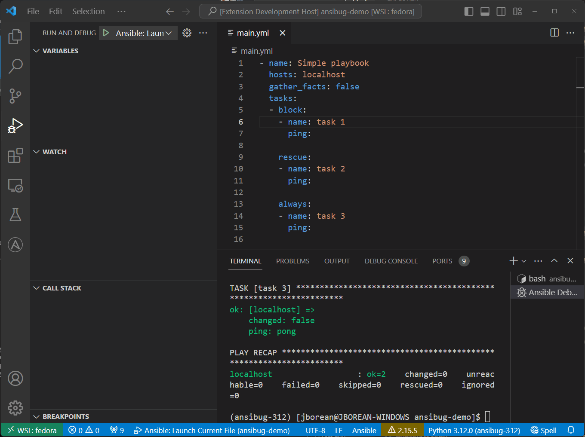

# Breakpoints
The first step to debugging a playbook is to place a breakpoint on the task you wish to stop at.



It is also possible to set a condition on the breakpoint so that it is only hit when the condition is tree.
The expression for a condition is treated as a template expression just like a `when` task condition.
For example to have the breakpoint only be hit when running on the host `MYSERVER` set the expression to `inventory_hostname == 'MYSERVER'`.



The expression will use the variables that are set at the time the breakpoint is set.
It is important not to use `{{ }}` in the expression as the value is already templated.
If the expression is an invalid template it will be treated as `False` and never be hit.

Part of the validation for breakpoints will update the client on the proper locations.
This will happen when the playbook starts if the task has already been loaded.
Otherwise for tasks dynamically loaded at runtime, with something like `include_tasks`, they will only be validated when they are loaded.



The breakpoints will always move to the first line of the previous task that is known to the debugger.

## Limitations
The following playbook/tasks entries cannot have a breakpoint set on them.

+ Play roles under `roles`

```yaml
- hosts: localhost
  roles:
  - role1
  - role2
```

+ `import_*` tasks

```yaml
- import_playbook: play.yml

- hosts: localhost
  tasks:
  - import_role:
      name: role1

  - import_tasks:
      file: tasks.yml
```

+ The `block`, `rescue`, and `always` lines in a block

```yaml
- block:  # Cannot set a breakpoint here
  - name: task 1
    ping:

  rescue:  # Will snapback to 'task 1'
  - name: task 2
    ping:

  always:  # Will snapback to 'task 2'
  - name: task 3
    ping:
```

Attempting to set a breakpoint on the `block` will be invalidated when the block is loaded.
Setting it on `rescue` or `always` will count as the previous task and will automatically be changed to the correct line when the block is loaded.



This is a limitation with the current breakpoint validation behavior as these entries are not seen by the debug code.
The only thing it can do is treat it as a line as part of the preceding task.
