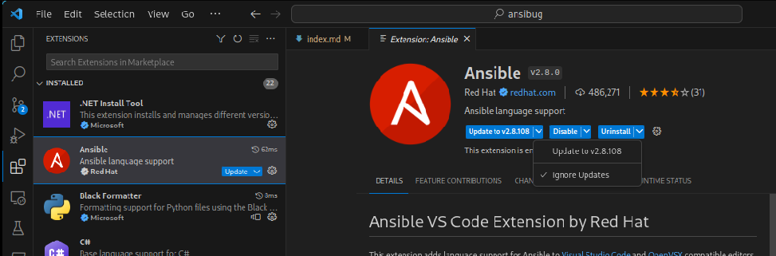
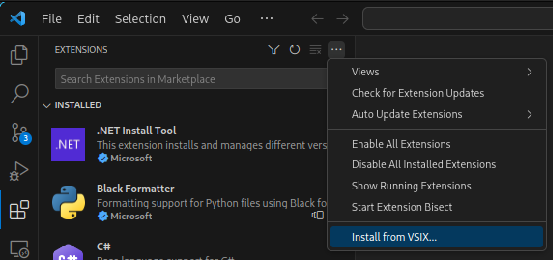
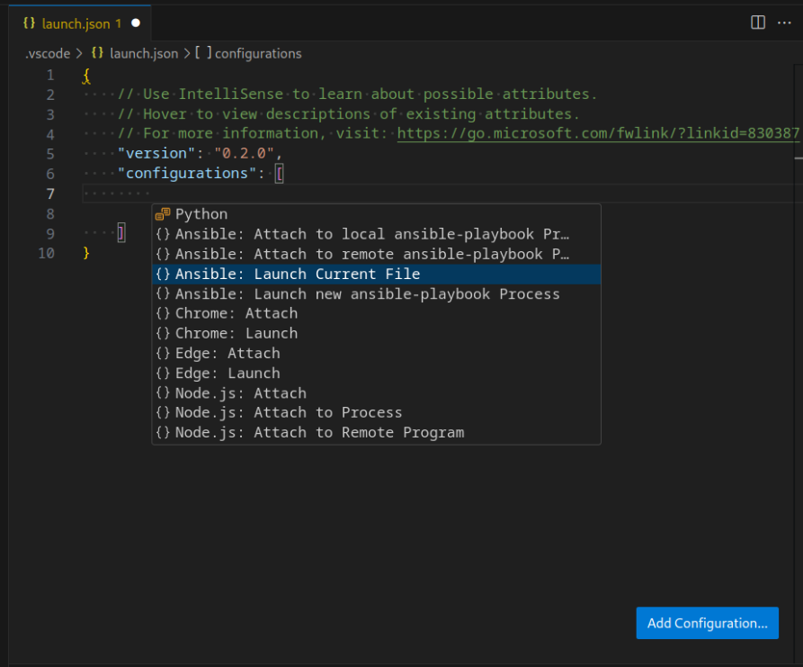

# Debug Adapter
This library is a Python based implementation of the [Debug Adapter Protocol](https://microsoft.github.io/debug-adapter-protocol/) (DAP) from Microsoft.
It is designed to create a universal debugger for Ansible playbooks that can be used by any client that implements DAP.
Currently the only tested client is with `Visual Studio Code` through a custom fork of the [vscode-ansible](https://github.com/ansible/vscode-ansible) extension so this guide uses examples from that.
There is a brief [video demo](https://youtu.be/pd2XGRbmt9A) that goes through some of the features of the debugger with Visual Studio Code.

During this preview period the behavior and functionality of the debugger may change based on user feedback.
Any changes will be documented in the changelog as new releases are pushed out.

Any feedback should be provided through

+ [Issues](https://github.com/jborean93/ansibug/issues) for bugs
+ [Discussions](https://github.com/jborean93/ansibug/discussions) to discuss current behaviour and proposed alternatives

Thanks to [ScreenToGif](https://www.screentogif.com/) which was used to create the gifs used in the documentation.

# Protocol Details
The `ansibug` library is specific a debug adapter implementation for Ansible.
It is in charge is understanding the messages sent by the client (VSCode) and handling them inside Ansible.

To understand more about `ansibug` and how it fits into the landscape of DAP see [protocol details](./protocol_details.md).

# How to Use
Installing `ansibug` by itself provides very little benefit as it is designed to be used with a DAP client like Visual Studio Code.
At the moment the changes needed to use `ansibug` with the Ansible VSCode extension is [currently part of a PR](https://github.com/ansible/vscode-ansible/pull/1006).
It is possible to get the `.vsix` needed to manually install the extension with the changes from the PR from the GitHub Actions Summary page for the PR.
A copy of this file is also stored [here](./resources/ansible-ansibug.vsix) which will be available until the PR is merged and part of an official release of the extension.

To install the extension and `ansibug` you can run the following:

```bash
# Installs ansibug to the current Python environment
python -m pip install ansibug

# Installs the vscode-ansible extension with ansibug integration
wget -O ansible-ansibug.vsix https://jborean93.github.io/ansibug/resources/ansible-ansibug.vsix
code --install-extension ansible-ansibug.vsix
```

It is important that updates are disabled for this extension which can be done through the GUI interface



_Note: Failing to disable auto updates will cause the extension to be updated to the latest release without ansibug support._

It is also possible to install the `vsix` file through the extension GUI.



It is still required to disable the automatic updates when installing the extension through this method.
Removing the extension is through the normal extension uninstallation method in VSCode.

Once installed a playbook can be debugged by configuring a [Launch Configuration](https://code.visualstudio.com/docs/editor/debugging#_launch-configurations).
There are four default samples you can use as a template, for example the `Ansible: Launch Current File` is a template that can be used to debug the current playbook file opened in the editor.



See [Debug Configurations](#debug-configurations) for more information on the launch vs attach types and the options that can be specified in the configuration json settings.

It is also possible to automatically launch the opened playbook file with F5 if `launch.json` does not exist or it contains no launch configurations.

# Features
Using `ansibug` with a playbook can expose the following features:

|Feature|Notes|
|-|-|
|[Breakpoints](./breakpoints.md)|Supports conditional breakpoints|
|[Stepping](./stepping.md)|Stepping in/out/over on tasks|
|[Multiple Hosts](./threads_and_frames.md)|A host is seen as a `thread`|
|[Variables and Watching](./variables.md)|Can get and set variables|
|[Debug Evaluation](./repl.md)|A repl console that can perform actions like templating|

The debug adapter works by using a custom strategy plugin to handle each task processing.
As this inherits the `linear` plugin it is not possible to use `ansibug` with a custom strategy.

# Debug Configurations
There are 2 debug configurations supported by this adapter:

+ Launch
+ Attach
  + By process id
  + By address

The majority of the cases will use the `Launch` configuration as it is simpler to use and covers the main use cases of Ansible debugging.

## Launch
The launch configuration will have the adapter launch a new `ansible-playbook` process and connect to it as it runs.
This will most likely be the more common configuration run by the adapter as it's simple to configure and run.
The Ansible output will be shown in realtime by the client and the debug lifetime is tied to that process spawned.

A launch configuration supports the following arguments:

|Options|Required|Default|Info|
|-|-|-|-|
|`playbook`|Y||The playbook to debug|
|`args`|||Extra arguments for the `ansible-playbook` process|
|`cwd`|||The working directory for the `ansible-playbook` process|
|`env`|||Extra environment variables for the `ansible-playbook` process|
|`connectTimeout`||5.0|The timeout, in seconds, to wait for the process to connect|
|`pathMappings`|||List of path mappings, see [Path Mappings](./remote_debugging.md#path-mappings)|
|`logFile`|||The path to file to log the debug code.|
|`logLevel`||info|The logging level, can be `info`, `debug`, `warning`, `error`.|

## Attach
The attach configuration is used to connect the debug client to an existing `ansible-playbook` process spawned by `ansibug`.
Attach is typically designed when trying to debug a playbook running on another host.
See [Remote Debugging](./remote_debugging.md) for more details on how to do this.
There are two common ways to specify the process to connect to:

+ By process id
  + Must be a process on the same host
+ By address
  + Can be a Unix Domain Socket path, or
  + A TCP hostname and port

As the attach process requires the debugging components to be enabled, Ansible **MUST** be started through `ansibug`.

```bash
# Replace ... with the same arguments for ansible-playbook ...
python -m ansibug listen ...
```

By default the listening process will use the address `uds://` to setup the listening socket.
This address is shorthand for creating a Unix Domain Socket under the temporary directory of the host, typically `/tmp/ansibug-dap-*`.
A custom address can be specified with `--addr` in the following formats:

|Address|Listen Only|Description|
|-|-|-|
|`uds://`|Y|Creates a UDS at the temp directory specified by Python with a unique filename, typically `/tmp/ansibug-dap-${UUID}`|
|`uds://filename`|N|A UDS `filename` under the temporary directory specified by Python, typically `/tmp`|
|`uds:/tmp/filename`|N|A UDS at `/tmp/filename`|
|`uds:///tmp/filename`|N|Same as the above|
|`tcp://`|Y|Binds to all IP interfaces with a random port|
|`tcp://:0`|Y|Same as `tcp://`, specifying port `0` for any option will choose a random port|
|`tcp://:1234`|Y|Binds to all IP interfaces with port `1234`|
|`tcp://hostname:1234`|N|Connects to `hostname` with port `1234`|
|`tcp://192.168.1.1:1234`|N|Connects to `192.168.1.1` with port `1234`|
|`tcp://[2001::1]:1234`|N|Connects to the IPv6 address `2001::1` with port `1234`|

Entries with `Listen Only` can only be used for starting a listening process.
The entries that are not `Listen Only` are designed for connecting using the attach configuration address described below.

As the listening process starts it will display both the process id as well as the address it is listening on.

> Ansibug listener has been configured for process PID 30011 on 'uds:///tmp/ansibug-dap-45a1d94e-8bc3-4b79-93a2-3857e30f7ebf'

The process will then wait until the debug client connects to it to start the playbook unless `--no-wait` is specified.
The client debug configuration can either specify `{"processId": 30011}` or `{"address": "tcp://localhost:34419"}` as part of the attach arguments, one of these options must be set.
If using the `processId`, the debug client will lookup the address details under `/tmp/ansibug-pid-$processId` created by the process.
Once connected the process will resume with the debug client connected.

An attach configuration supports the following arguments:

|Options|Required|Default|Info|
|-|-|-|-|
|`processId`|||The local process id to attach to|
|`address`|||The socket address to attach to|
|`connectTimeout`||5.0|The timeout, in seconds, to wait to attach to the process|
|`useTls`||false|Wraps the socket with TLS, see [TLS](./remote_debugging.md#tls)|
|`tlsVerification`||verify|TLS verification settings, sett [TLS](./remote_debugging.md#tls)|
|`pathMappings`|||List of path mappings, see [Path Mappings](./remote_debugging.md#path-mappings)|

_Note: Specifying `processId` will override the value for `address`._

# Logging
In case something goes wrong, it is possible to add logging for both the DA Server and Debuggee side.
To log the DA Server components the specify `--log-file` and optionally `--log-level` when calling `python -m ansibug dap`.
As this is a core component of how the debug client interacts with `ansibug`, actually setting these options are client specified.

To enable logging for the Debuggee side with a launch configuration the following launch arguments can be set:

```json
{
  "logFile": "/tmp/ansibug-debuggee.log",
  "logLevel": "debug"
}
```

Setting the log for launch is done through the `--log-file` and `--log-level` args with `python -m ansibug listen` command.
