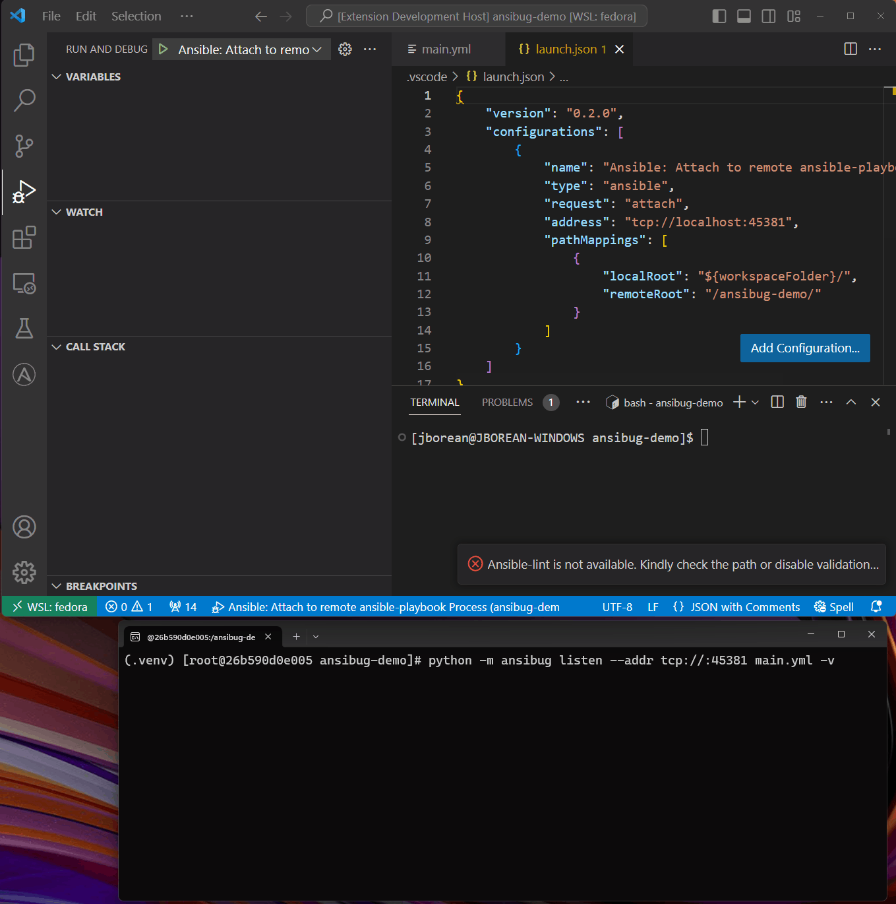

# Remote Debugging
It is possible to use `ansibug` to debug a playbook that runs on another host through socket connections.
This document will cover how to setup the remote and local host, how TLS can be used to protect the communication, and how to setup path mapping for breakpoint alignment.

## Setting Up a Remote Debugger
The first step for setting up a remote debugger is to ensure the same playbook files that are being run are on both the local and remote host.
Using a different set of files will result in undefined behavior where breakpoints might be missed or will be set for different tasks than what is seen by the client.
Using a tool like [rsync](https://linux.die.net/man/1/rsync) can help with ensuring these files are synchronized during development.
In this example the local client has the playbook files under `/home/my-user/dev/ansible-apache/` and the remote host has them under `/home/ansible/playbooks/ansible-apache/`.

Once the playbooks have been set up the `ansibug` library must be installed on both the client and remote Pythons.
Only the remote needs to have `ansible-core` itself installed, the client only needs `ansibug`.

When `ansibug` has been installed, the `ansible-playbook` process must be launched in listen mode:

```bash
# Will bind to a randomly available port
python -m ansibug listen \
    --addr tcp://
    /home/ansible/playbooks/ansible-apache/main.yml

# To bind to a specific port do
python -m ansibug listen \
    --addr tcp://:1234
    /home/ansible/playbooks/ansible-apache/main.yml
```

It is important that any firewall rules on the host allow incoming requests on the port that is used on the listening process.
As there is no authentication with the TCP connection it is important to be aware that anyone with access to this host with this socket can now attach a debugger to this process.
Using TLS can be a way to protect the connection with a client certificate if needed, see [TLS](#tls) for more details.

Once the listener is up and running the local debug client can now connect to it with the following attach configuration:

```json
{
    "request": "attach",
    "address": "tcp://remote-host:1234",
    "pathMappings": [
        {
            "localRoot": "/home/my-user/dev/ansible-apache/",
            "remoteRoot": "/home/ansible/playbooks/ansible-apache/"
        }
    ]
}
```

Once connected the `ansible-playbook` process will continue to run and any breakpoints set will stop as a normal launch configuration.



## TLS
By default the data exchanged by `ansibug` is in plaintext text.
This is not ideal when communicating over a network as it allows others to see the data that was exchanged.
It is possible to use TLS to wrap the socket communication so that the data is encrypted and for the client to verify the server's identity.
It is also possible to use TLS client authentication to ensure only authorized clients can connect to the listening process.
To wrap the socket communication with TLS, use the following arguments when calling `python -m ansibug listen`:

+ `--wrap-tls`
  + Enabled TLS on the socket
+ `--tls-cert`
  + Path to a PEM formatted TLS server certificate
  + Can also include the PEM formatted key in the same file
+ `--tls-key`
  + Path to a PEM formatted TLS server key
  + Not needed if the key is with the certificate file
+ `--tls-key-pass (or the env var ANSIBUG_TLS_KEY_PASS)`
  + The password used to decrypt the key if it is encrypted
+ `--tls-client-ca`
  + Path to a PEM formatted CA bundle file or directory
  + Enforces client certificate authentication on the connection
  + The client must provide a cert/key that has been signed/issued by a CA in the bundle provided

When the debug client goes to launch an [attached debugger](./index.md#attach) with a TLS wrapped connection it can specify the following arguments:

|Option|Default|Description|
|-|-|-|
|`useTls`|false|Set to true to turn on TLS when attaching|
|`tlsVerification`|verify|The TLS verification settings, see below|
|`tlsCertificate`||The path to a PEM encoded certificate for client authentication|
|`tlsKey`||The path to a PEM encoded key for client authentication|
|`tlsKeyPassword`||The password needed to unlock the `tlsKey` if needed|

The `useTls` option must be set to `true` to enable TLS on the socket communication.
The `tlsVerification` setting can be set to:

+ `verify` (default)
  + Does all the standard TLS verification checks with the hostname/CA
+ `ignore`
  + Ignores any TLS verification checks
+ Any cert file/dir
  + The file or directory containing the CA bundles to use for the CA verification checks

The `tlsCertificate` is used to provide a certificate for client authentication if the server requires it.
The certificate/key provided must be signed by a CA in the trusted bundle set by the server.
There are no checks around the key usage or extended key usage, the only check is the certificate issuer.
The file can be the certificate and key together, if it's just the certificate, `tlsKey` must be set to the corresponding key.

_Note: When attaching by `processId`, the `useTls` setting does not need to be specified as it is contained in the local process metadata._

It is possible to use TLS with a Unix Domain Socket listener or just a TCP socket listening in on localhost but the main use case for TLS is for cross host communication.

While in a real scenario a proper key signed by a trusted PKI environment should be used, the following can generate some test certificates used for localhost:

```bash
openssl ecparam \
    -name secp384r1 \
    -genkey \
    -noout \
    -out ansibug-ca.key

openssl req \
    -new \
    -x509 \
    -out ansibug-ca.pem \
    -key ansibug-ca.key \
    -days 365 \
    -subj "/CN=Ansibug CA"

openssl ecparam \
    -name secp384r1 \
    -genkey \
    -noout \
    -out ansibug.key

openssl req \
    -new \
    -x509 \
    -out ansibug.pem \
    -key ansibug.key \
    -days 365 \
    -subj "/CN=ansibug" \
    -addext "subjectAltName = DNS:localhost,IP:127.0.0.1" \
    -CA ansibug-ca.pem \
    -CAkey ansibug-ca.key

openssl ecparam \
    -name secp384r1 \
    -genkey \
    -noout \
    -out ansibug-client.key

openssl req \
    -new \
    -x509 \
    -out ansibug-client.pem \
    -key ansibug-client.key \
    -days 365 \
    -subj "/CN=My Client" \
    -addext "extendedKeyUsage = clientAuth" \
    -CA ansibug-ca.pem \
    -CAkey ansibug-ca.key

rm ansibug-ca.key
cat ansibug.key >> ansibug.pem
cat ansibug-client.key >> ansibug-client.pem
rm ansibug.key
rm ansibug-client.key
```

_Note: This not a secure way to store these keys and should only be used for testing purposes._

With these certificates a listener `ansible-playbook` process can be started with:

```bash
python -m ansibug \
    listen \
    --wrap-tls \
    --tls-cert ansibug.pem \
    --addr tcp:// \
    main.yml
```

The debug client can then specify the following in its attach configuration

```json
{
    "type": "attach",
    "address": "tcp://listening-host:12345",
    "wrapTls": true,
    "tlsVerification": "ansibug-ca.pem"
}
```

FIXME: Add support for TLS client certificates

## Path Mappings
As breakpoints are based on the path of the file it is important that Ansible aligns the file that it is using with the files in the debug client.
For a launch of local attach scenario this happens by default when using the same playbook file for both Ansible and the debug client.
For a remote attach scenario it is most likely the paths will be different.

To overcome this hurdle a debug configuration can specify the `pathMappings` options which is a list of remote and local roots that are equivalent to each other.

For example if the debug client is using the playbook at `/home/local/dev/project/main.yml` and is attaching to a host where the same playbook is at `/usr/local/share/project/main.yml` on the remote host; use the following `pathMappings` configuration:

```json
{
  "pathMappings": [
    {
      "localRoot": "/home/local/dev/project/",
      "remoteRoot": "/usr/local/share/project/"
    }
  ]
}
```

Multiple mappings can be specified if there are different paths used, the first one that matches will be used in the substitution.
The paths are also matched in a case sensitive way so it is important to have that correct.
