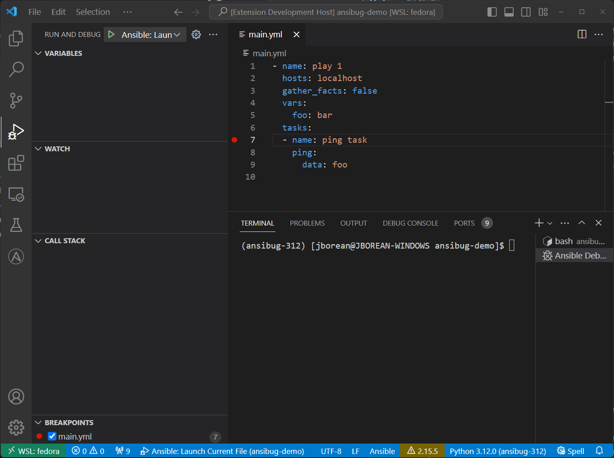
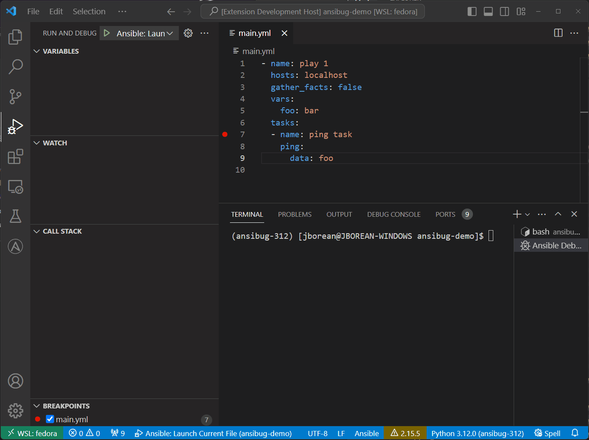
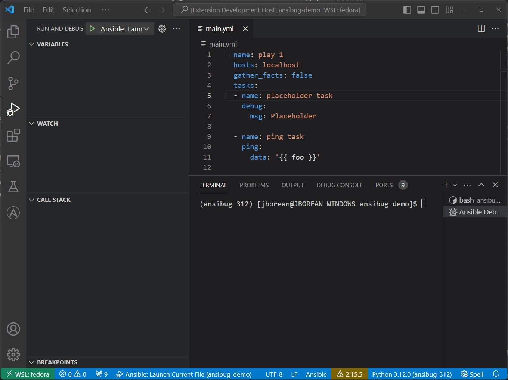
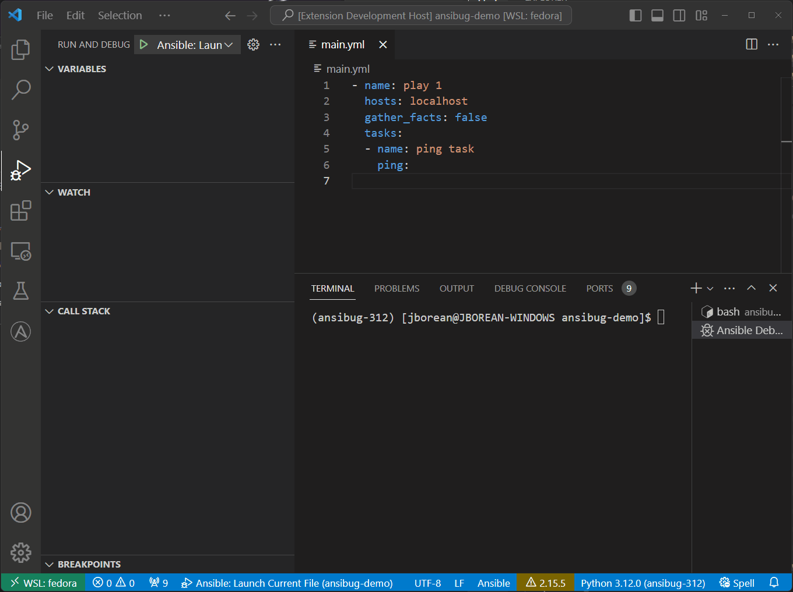

# Debug Console
The Debug Console in Visual Studio Code can be used to perform some actions that are not exposed through the GUI or just as a convenience.
The Debug Console for `ansibug` has the following commands that can be used:

+ `!remove_option (ro)`
+ `!set_option (so)`
+ `!set_hostvar (sh)`
+ `!template (t)` (default is no command specified)
+ `!--help`

Each command must be preceded by `!` for it to be interpreted as a command.
If `!` is omitted then the `!template` command is assumed and the value provided is templated as is.
Use `!--help` to see the help message for the repl, it is also possible to do `!command --help` to see the help for a specific command, for example `!set_option --help`.

## Remove Option
The `!remote_option` or `!ro` option can be used to remove a module option from the current task.
Specify the module option to remove after the command like `!remote_option data`.

An alternative way to do this is to set the value to `omit` through the normal variable menu:

## Set Hostvar
While it is possible to set a host var through the normal variable menu, it is not possible to add a new hostvar this way.
The `!set_hostvar` command can be used to both add and set variables in the hostvar scope.

The command format is `!set_hostvar varname expression`, to set a variable with a space in the name it should be quoted.
The expression is just like any other expression value which is templated before it is set.

This wil set both the hostvar and taskvar for the current task so the changes apply before it is run as well as for future tasks.

## Set Option
Like `!set_hostvar`, the `!set_option` repl command can be used to add/set module options for the current task.

The command format is `!set_option option_name expression`, to set a variable with a space in the name it should be quoted.
As with `!set_hostvar` the expression is templated before being set, the value should be quoted if a literal string value is desired.
Use this in conjunction with `!remove_option` to remove a module option or by manually setting existing module option variables that have been defined already.

## Template
The final command is `!template` which can be used to evaluate an expression and return the resulting value.
If no command is specified in the repl, then the `!template` command is used by default.
The command format is `!template expression` where the expression is the value to be evaluated.

In the example above the variable `my_variable` to templated with `| to_nice_yaml` using the `!template` command and just without any command specified.
It also shows how it can be possible to provide any Python/Jinja2 data structure as part of the templating.
Use this command to test out templates to ensure the resulting values are what is expected.
