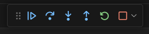
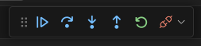
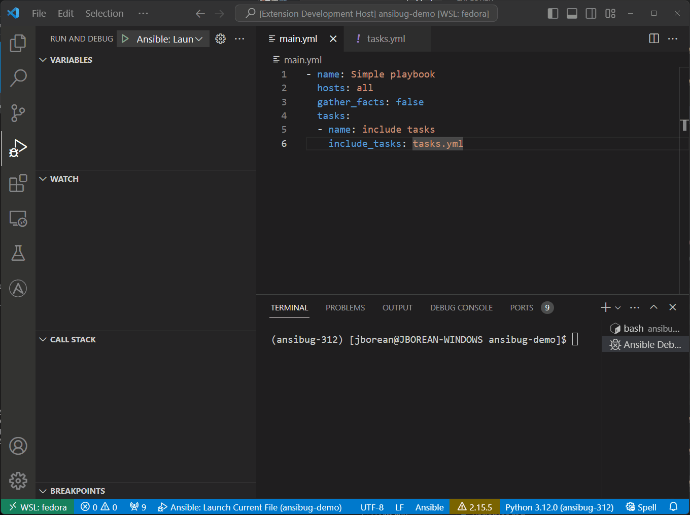
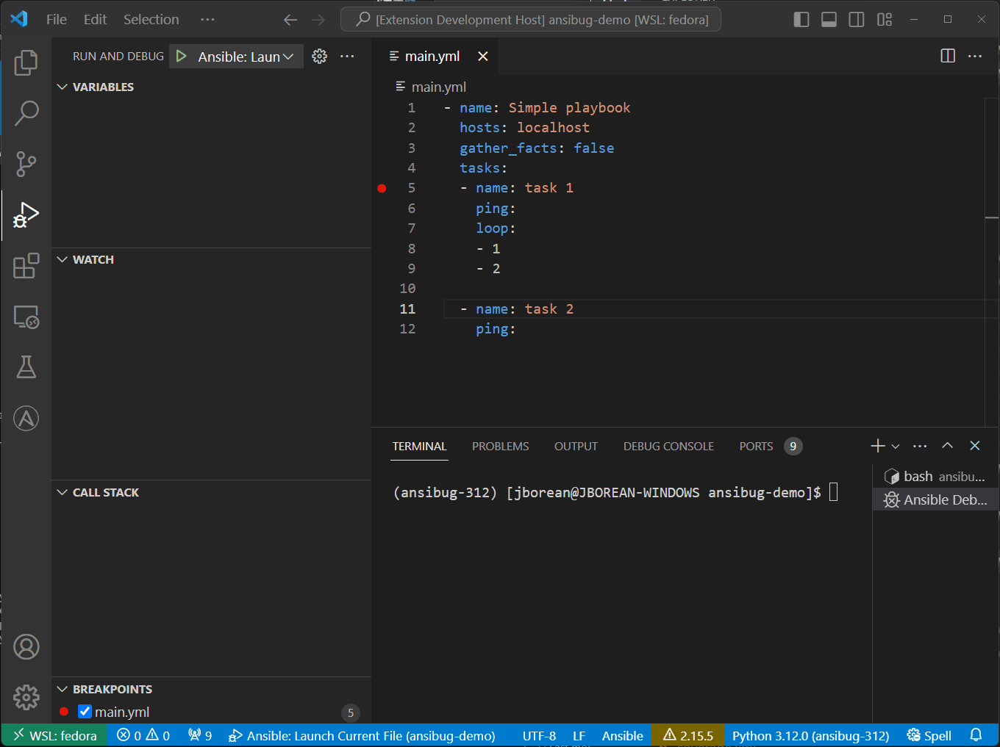

# Stepping
When a breakpoint is hit there are 4 options that are available.
Depending on the debug configuration type used, the following stepping panel will look like one of the following:

**Stop**



**Disconnect**



In order the options are:

+ Continue
  + Will continue the execution until the next breakpoint is hit
+ Step over
  + Will stop on the next task even without a breakpoint on it
+ Step in
  + For `include_*` tasks, will stop at the first task that is included
  + For any other tasks it acts like step over
+ Step out
  + Will step out on the parent stack frame
  + For example when run in a task inside an `include_*` tasks, a step out will break on the task after the `include_*`
+ Restart
  + Currently this works just like `Stop`
+ Stop (Default for Launch)
  + Will stop the executing `ansible-playbook` process that is being debugged
  + No more tasks/plays will be run and the debug session will be closed.
+ Disconnect (Default for Attach)
  + Will disconnect the debug session
  + The `ansible-process` will continue to run in the background

While the defaults for a launch and attach session is to stop or disconnect respectively, it is possible to choose the opposite by either holding down the alt key or selecting the other option in the drop down menu for that icon.

Currently `ansibug` does not support disconnect with suspend or a way to reattach to a disconnected session.
These features may be added in the future if there is demand for it.

You can use the stack frames on the host list to determine the current level the task is running under.
A step out will move back a frame and onto the next task after it.

When a playbook is run, each task on each host is considered a valid step to be checked for a breakpoint.
If a breakpoint is set on a task which will run for 2 hosts, the breakpoint will be hit for both.



In this example a play is running on `host1` and `host2` with a single breakpoint on a task.
The first host will stop at the breakpoint with the stack and variables for that host shown.
When the execution is continued the breakpoint will then stop for `host2` at the same task.
To set a breakpoint only for a single or subset of hosts, use a conditional expression for the breakpoint on `inventory_hostname` or any other relevant hostvar.

## Static Imports

As `import_*` tasks are resolved statically before being seen by the debuggee they are not treated like `include_*` tasks.
Stepping out of a task added by `import_tasks` will not step out to the task after the `import_tasks`.
For example

```yaml
# main.yml
- name: task 1
  import_tasks:
    file: tasks.yml

- name: task 2
  ping:

# tasks.yml
- name: task 3  # Currently stopped here
  ping:
```

Stepping out of `task 3` will step out of the whole play because the `import_tasks` is not part of the known stack to the debugger.

## Loops
Task loops with `loop`, `with_*`, or `until` are treated as a single task, the breakpoint will fire before the task is run and will not hit during the loop iterations.
For example:



This is a limitation due to the ways are run in Ansible.
The strategy plugin has no control over the loop iterations so it cannot pause during the iteration.
