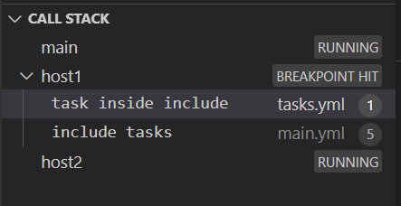
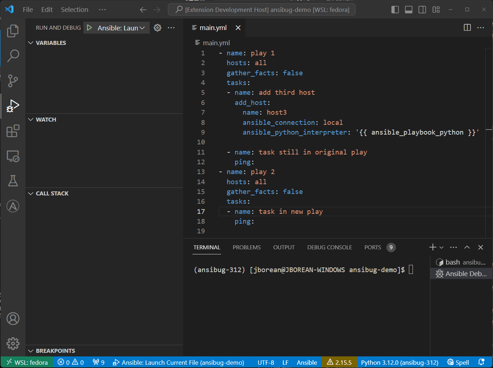

# Threads and Frames
One component of the debug adapter protocol is the concept of a thread and a stack frame.
Translated to Ansible a thread is seen as a host whereas a stack frame is shown as the stack on which a task is located.

In the callstack we can see the list of hosts shown as threads.
Here we have the threads `main` representing the current strategy execution and `host1`, `host2` for the two hosts in the play.
The stack shows the breakpoint has been hit for `host1` alongside the stack frames for that host/thread.
In this case the top stack frame represents the task the breakpoint has stopped on and subsequent stack frames are the parent `include_*` tasks if there are any.
It is possible to click on the parent stack frames to have the client automatically move to that location and show the variables for that task.
Frames will not be shown for other hosts until the breakpoint for that host has been hit.
Using the frame is a good way to understand where a `Step Out` action will move to.

## Adding Hosts and Inventory Refreshes
Ansible offers the ability to add hosts dynamically with [add_host](https://docs.ansible.com/ansible/latest/collections/ansible/builtin/add_host_module.html) or add/remove hosts with [meta: refresh_inventory](https://docs.ansible.com/ansible/latest/collections/ansible/builtin/meta_module.html).
Running these modules will only affect a play after the one where `add_host` or `meta: refresh_inventory` was run on.
Nothing special needs to be done to handle this scenario.

In this case the `ping` task after `add_host` will still only run for `host1` and `host2`.
The `ping` task in the new play will run for `host1`, `host2`, and `host3` that was added.
