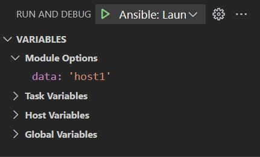
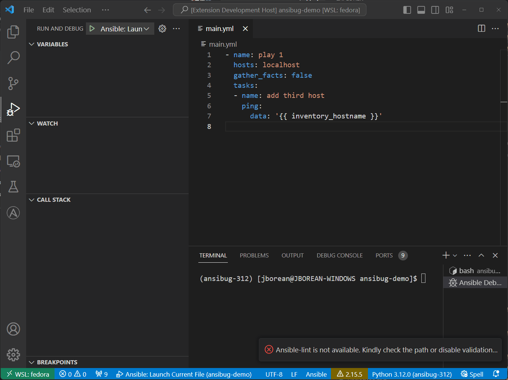
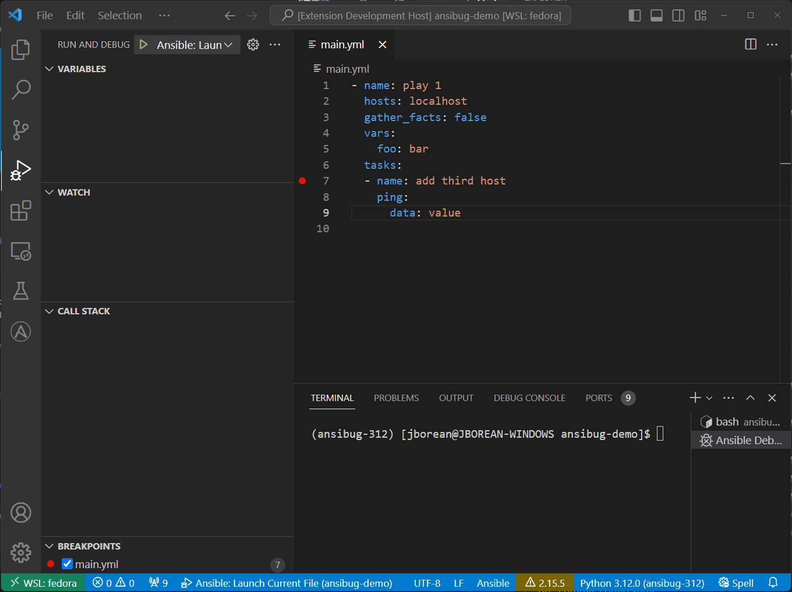
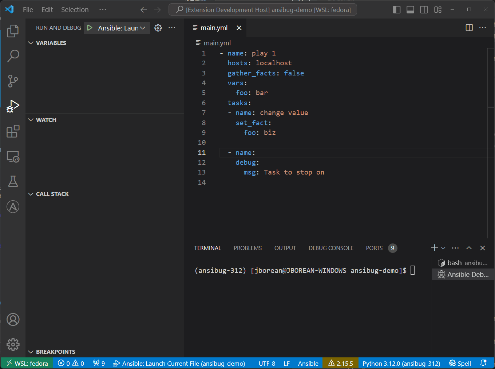

# Variables
With `ansibug` it is possible to get and set variables when a breakpoint has been hit.
This guide will go over how it is done in Visual Studio Code, the scopes that are exposed, and ways to set them.

## Scopes
There are current four scopes that are implemented in `ansibug`:



Module Options are options set on the module itself.
For example:

```yaml
- file:
    path: /tmp/directory
    state: absent
```

The module options here will be `path`, and `state`.
The values shown will be the final values post Jinja2 templating allowing you to see the value that will be provided to the module when run.

Task Variables are are a snapshot of the variables that are provided to the forked worker specifically for that task.
They are similar to host variables but setting them will only be scoped to that task and will not persist beyond the task.

Host Variables are host variables and facts for the current host the breakpoint has stopped for, in Ansible they are commonly accessed through `{{ hostvars[inventory_hostname] }}`.
Unlike Task Variables, setting a host variable will persist beyond the current task similar to how `set_fact` works.

The final scope `Global Variables` are all the variables known to Ansible, including variables for other hosts.
In Ansible they are commonly accessed through `{{ vars }}`.

## Setting Variables
It is possible to set a variable through the client by right clicking the variable and specifying the new value.



The value provided is templated automatically by `ansibug` so it is important to quote the value when a string value is set.
In other words, the value provided will be automatically wrapped with `{{ ... }}` by `ansibug`.

For example setting `'string value'` will set the literal string value `string value`.
Setting `foo` will be evaluating `{{ foo }}` so will set it to the value of that variable.



Attempting to set a poorly formed template or a template that fails will fail.
A template has access to all the task variables of the current task as well as lookups and filters available in any other template operation.

It is also possible to set module options and hostvars using the Debug Console repl.
See [Debug Evaluation](./repl.md) for more details there.

## Watch
Using the `Watch` panel, it is possible to set an expression that will be automatically validated on each step.



In the above example a watch has been added for the expression `foo` which just returns the value of `foo`.
The first task has the expression equal to `bar` which is the original value but the next task after it has changed will show the updated value.

Just like setting a variable value, the expression for the watch is also templated automatically by `ansibug`.
Do not wrap the expression with `{{ ... }}` as it will cause errors during the templating operation.
